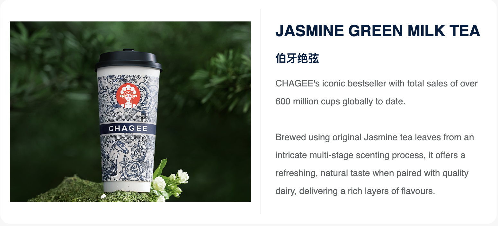
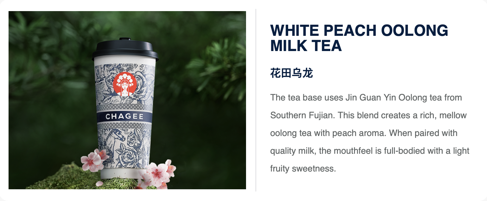

# HTML beginner, CHARGEE

<html lang="en">
<head>
    <meta charset="UTF-8">
    <meta name="viewport" content="width=device-width, initial-scale=1.0">
    <title>My Favorite Milktea Shop</title>
</head>
<body>
    <main>
        <h1>CHARGEE</h1>
        
A milktea shop that is popular in China called CHARGEE.  Learn more about the brand <a href="https://en.wikipedia.org/wiki/Chagee" target="_blank">here</a> or <a href="https://chagee.com.my/" target="_blank">here</a>  Personally favorite is the jasmine green milk tea. 

        <ol>
            <li>Milk Tea Series</li>
            <li>Snowy Frappé Series</li>
            <li>Brew Tea Series</li>
            <li>Fruit Tea series</li>
            <li>Teaspresso · Tea Latte</li>
            <li>Iced Oriental Tea</li>
            <li>Teaspresso · Tea Frappé</li>
        </ol>
        
        
        
    </main>
    <footer>CW</footer>
</body>
</html>
